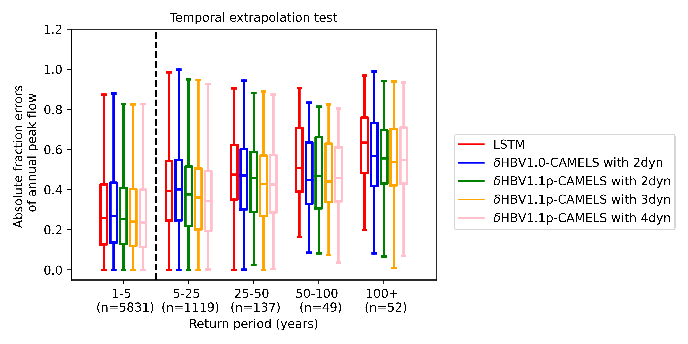
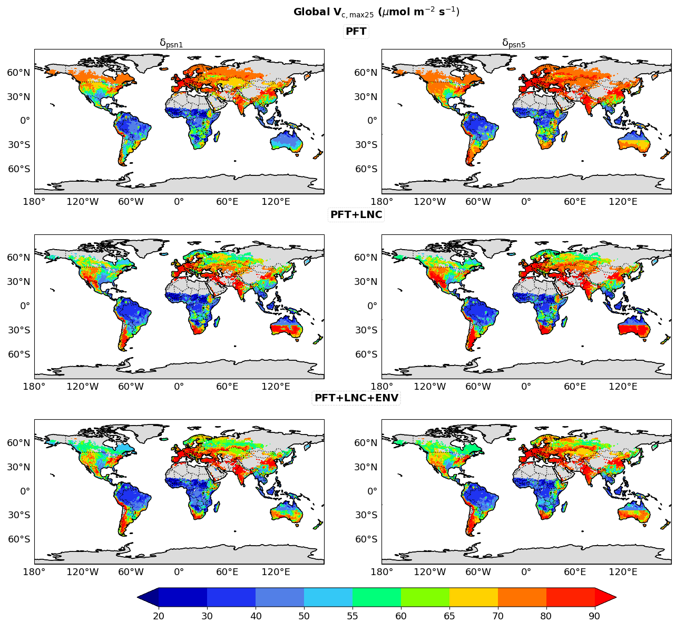

# dMG: The Generic Differentiable Modeling Framework on PyTorch

[](https://www.python.org/downloads/)
[](https://github.com/mhpi/generic_deltaModel/actions/workflows/pytest.yaml)
[](https://github.com/astral-sh/ruff)

[](https://github.com/mhpi/generic_deltaModel/blob/master/LICENSE)
[](https://doi.org/10.5281/zenodo.14868671)

A domain-agnostic, PyTorch-based framework for developing trainable [differentiable models](https://www.nature.com/articles/s43017-023-00450-9) that merge neural networks with process-based equations. "Differentiable" means that gradient calculations can be achieved efficiently at a large scale throughout the model, so process-based equations can be trained together with NNs on big data, on GPU. Following as a generalization of `HydroDL`, dMG aims to expand differentiable modeling and learning capabilities to a wide variety of domains where prior equations can bring in benefits.

dMG is not a particular model, but package-framework hybrid that supports many models (e.g., HydroDL2.0) across various domains in a uniform way while integrating ecosystem tools. This generalized product has been a long time in the making, as a result of years working with various differentiable models across domains. Most differentiable modeling efforts in MHPI will be using dMG, and this will minimize hurdles with distributing such research products. dMG models and experiments can be controlled by a configuration file to simplify usage. We include a Graphical User Interface that allows easy job customization. dMG closely synergizes with advanced deep learning tools like foundation models and the leverages the scale advantage of PyTorch. According to our peer-reviewed, published benchmarks, well-tuned differentiable models can match deep networks in performance while extrapolating better in data-scarce regions or extreme scenarios and outputting untrained variables with causal, physical interpretability.

While differentiable models are powerful and have many desirable characteristics, they come with a larger decision space than purely data-driven neural networks since physical processes are involved, and can thus feel "trickier" to work with. Hence, we recommend first reproducing our results (see [examples/](/example/hydrology/))and then systematically making changes, one at a time. We also recommend focusing on the multifaceted outputs, diverse causal analyses, and predictions of untrained variables permitted by differentiable models, rather than purely trying to outperform other models' metrics.

This package is maintained by the [MHPI group](http://water.engr.psu.edu/shen/) advised by Dr. Chaopeng Shen. If you find this work useful, please cite the following paper for now (we will have more dedicated citations later): Shen, C., et al. (2023). Differentiable modelling to unify machine learning and physical models for geosciences. Nature Reviews Earth & Environment, 4(8), 552–567. <https://doi.org/10.1038/s43017-023-00450-9>.

</br>

## Ecosystem Integration

- **HydroDL2.0 ([`hydroDL2`](https://github.com/mhpi/hydroDL2))**: Home to MHPI's suite of process-based hydrology models and differentiable model augmentations (think variational data assimilation, model coupling, and other tools designed for hydrology).
<!-- - **HydroData ([`hydro_data_dev`](https://github.com/mhpi/hydro_data_dev))**: Data extraction, processing, and management tools optimized for geospatial datasets. (In development) -->
<!-- - **Config GUI ([`GUI-Config-builder`](https://mhpi-spatial.s3.us-east-2.amazonaws.com/mhpi-release/config_builder_gui/Config+Builder+GUI.zip))([Source](https://github.com/mhpi/GUI-Config-builder))**: An intuitive, user-friendly tool designed to simplify the creation and editing of configuration files for model setup and development. -->
- **Differentiable Ecosystem modeling ([`diffEcosys (dev version only)`](https://github.com/hydroPKDN/diffEcosys/))**: A physics-informed machine learning system for ecosystem modeling, demonstrated using the photosynthesis process representation within the Functionally Assembled Terrestrial Ecosystem Simulator (FATES) model. This model is coupled to neural networks that learn parameters from observations of photosynthesis rates.
- **Concurrent development activities**: Many concurrent development activities are currently in the works: (i) numerical PDE solvers on PyTorch, torchode, torchdiffeq; (ii) [adjoint](https://doi.org/10.5194/hess-28-3051-2024) sensitivity; (iii) extremely efficient and highly accurate surrogate models for process-based equations; (iv) data assimilation methods; (v) downscaled and bias-corrected climate data; (vi) mysteriously powerful neural networks, and more ...
</br>

## Key Features

- **Hybrid Modeling**: Combines neural networks with process-based equations for enhanced interpretability and generalizability. Instead of manual model parameter calibration, for instance, use neural networks to directly learn robust and interpretable parameters ([Tsai et al., 2021](https://doi.org/10.1038/s41467-021-26107-z)).

- **PyTorch Integration**: Easily scales with PyTorch, enabling efficient training and compatibility with modern deep learning tools, trained foundation models, and differentiable numerical solvers.

- **Domain-agnostic and Flexible**: Extends differentiable modeling to any field where physics-guided learning can add value, with modularity to meet the diversity of needs along the way.

- **Benchmarking**: All in one place. dMG + hydroDL2 will enable rapid deployment and replication of key published MHPI results.

- **NextGen-ready**: dMG is designed to be [CSDMS BMI](https://csdms.colorado.edu/wiki/BMI)-compliant, and our differentiable hydrology models in hydroDL2 come with a prebuilt BMI allowing seamless compatibility with [NOAA-OWP](https://water.noaa.gov/about/owp)'s [NextGen National Water Modeling Framework](https://github.com/NOAA-OWP/ngen). (See the NextGen-ready [𝛿HBV2.0](https://github.com/mhpi/dHBV2.0) for an example with a dMG-supported BMI). Incidentally, this capability also enables dMG to be readily interfaced with other applications.

</br>

## Use Cases

### 1. General Hydrologic Modeling

- Lumped differentiable rainfall-runoff models [𝛿HBV1.0](https://agupubs.onlinelibrary.wiley.com/doi/epdf/10.1029/2022WR032404) and improved [𝛿HBV1.1p](https://essopenarchive.org/doi/full/10.22541/essoar.172304428.82707157).

- Global- and  [national-scale water model](https://agupubs.onlinelibrary.wiley.com/doi/pdf/10.1029/2024WR038928) providing high-quality seamless hydrologic [simulations](https://mhpi.github.io/datasets/CONUS/) across CONUS and the globe.

- Many other use cases are currently in development and will released with paper publications.

### 2. Unseen Extreme Events Test with 𝛿HBV1.1p

In the unseen extreme events spatial test, we used water years with a 5-year or lower return period peak flow from 1990/10/01 to 2014/09/30 for training, and held out the water years with greater than a 5-year return period peak flow for testing. The spatial test was conducted using a 5-fold cross-validation approach for basins in the [CAMELS dataset](https://gdex.ucar.edu/dataset/camels.html). This application has been benchmarked against LSTM and demonstrates better extrapolation abilities. More details and results can be found in [Song, Sawadekar, et al. (2024)](https://essopenarchive.org/doi/full/10.22541/essoar.172304428.82707157).



### 3. National-scale water modeling using 𝛿HBV2.0

This is a national-scale water modeling study on approximately 180,000 river reaches (with a median length of 7 km) across CONUS using a high-resolution, multiscale, differentiable water model. More details and results can be found in [Song, Bindas, et al. (2025)](https://agupubs.onlinelibrary.wiley.com/doi/pdf/10.1029/2024WR038928).


### 4. Global-scale Photosynthesis Modeling

Currently in development, See more details and results in [Aboelyazeed et al. (2024)](https://doi.org/10.22541/au.173101418.87755465/v1).



</br>

## Differentiable Modeling and the dMG Framework

Characterized by the combination of process-based equations and neural networks (NNs), differentiable models train these components together, enabling parameter inputs for the equations to be effectively and efficiently learned at scale by the NNs. Alternatively, one can also have NNs learning the residuals of the physical models. There are many possibilities for how such models are built.

In 𝛿MG, we define a differentiable model with the class *DeltaModel* that can couple one or more NNs with a process-based model (itself potentially a collection of models). This class holds `nn` and `phy_model` objects as internal attributes, and describes how they interface with each other. The *DeltaModel* object can be trained and forwarded just like any other PyTorch model (nn.Module).

We also define *DataLoader* and *DataSampler* classes to handle datasets, a *Trainer* class for running training/testing experiments, and a *ModelHandler* class for multimodel handling, multi-GPU training, data assimilation, and streaming in a uniform and modular way. All model, training, and simulation settings are collected in a configuration file that can be adapted to custom applications. According to this schema, we define these core classes from the bottom up:

- **nn**: PyTorch neural networks that can learn and provide either parameters, missing process representations, corrections, or other forms of enhancements to physical models.
- **phy_model**: A physical (process-based) model written in PyTorch (or potentially another interoperable differentiable platform) that takes learnable outputs from the `nn` model(s) and returns a prediction of some target variable(s). This can also be a wrapper holding several physical models.
- **DeltaModel**: Holds (one or multiple) `nn` objects and a `phy_model` object, and describes how they are coupled (e.g., `DplModel`); connection to ODE packages.
- **ModelHandler**: Manages multimodeling, multi-GPU computation, and data assimilation or streaming. Can contain its own optimizers. Acts as an interface to CSDMS BMI or other interfaces.
- **Trainer**: Manages model training and testing, and connects data to models.
- **DataSampler**: Samples data according to data format and training/testing requirements.
- **DataLoader**: Preprocesses data to be used in training, testing, and simulations.

</br>

## Repository Structure

    .
    ├── src/dMG/
    │   ├── __main__.py                 # Runs dMG; models, experiments
    │   ├── core/                       
    │   │   ├── calc/                   # Calculation utilities
    │   │   ├── data/                   # Data loaders and samplers
    │   │   ├── post/                   # Post-processing utilities; plotting
    │   │   └── utils/                  # Helper functions
    │   ├── models/                     
    │   │   ├── criterion               # Loss functions  
    │   │   ├── delta_models            # Differentiable model modalities
    │   │   ├── multimodels             # Multimodeling processors
    │   │   ├── neural_networks/        # Neural network architectures
    │   │   ├── phy_models/             # Physical Models
    │   │   └── model_handler.py        # High-level model manager
    │   └── trainers/                   # Model training routines
    ├── conf/
    │   ├── hydra/                      # Hydra settings
    │   ├── observations/               # Observation configuration files
    │   ├── config.py                   # Configuration validator
    │   └── default.yaml                # Default master configuration file
    ├── docs/                           
    ├── envs/                           # Python ENV configurations
    └── example/                        # Tutorials

</br>

## Quick Start: Building a Differentiable HBV (𝛿HBV) Model

For this case, we use an [LSTM](https://en.wikipedia.org/wiki/Long_short-term_memory) neural network to learn parameters for the [HBV](https://en.wikipedia.org/wiki/HBV_hydrology_model) physics-based hydrological model.

    ```python
    from hydroDL2.models.hbv.hbv import HBV
    
    from dMG.core.data.loaders import HydroLoader
    from dMG.core.utils import load_nn_model, print_config, set_randomseed
    from dMG.models.delta_models import DplModel
    from example import load_config, take_data_sample

    CONFIG_PATH = '../example/conf/config_dhbv_1_0.yaml'


    # 1. Load configuration dictionary of model parameters and options.
    config = load_config(CONFIG_PATH)

    # 2. Initialize physical model and NN.
    phy_model = HBV(config['delta_model']['phy_model'])
    nn = load_nn_model(phy_model, config['delta_model'])

    # 3. Load and initialize a dataset dictionary of NN and HBV model inputs.
    dataset_dict = HydroLoader(config).dataset
    dataset_sample = take_data_sample(config, dataset_dict, days=730, basins=100)

    # 4. Create the differentiable model dHBV: a torch.nn.Module that describes how 
    # the NN is linked to the physical model HBV.
    dpl_model = DplModel(phy_model=phy_model, nn_model=nn)


    ## From here, forward (run) or train dpl_model just as any torch.nn.Module model.

    # 5. For example, to forward:
    output = dpl_model.forward(dataset_sample)
    ```

In the above, we expose a critical characteristic of the differentiable model object `DplModel`: it is composed of the physical model, `phy_model`, and a neural network, `nn`.

When we forward `DplModel`, scaled inputs (stored within the dataset dictionary) are fed into the NN, which returns a set of simulated parameters. These parameters are then given to the physical model to forward and output final model predictions. Internally, these steps are represented by

    ```python
    # NN forward
    parameters = self.nn_model(dataset_sample['xc_nn_norm'])        

    # Physics model forward
    predictions = self.phy_model(
        dataset_sample,
        parameters,
    )
    ```

Check out [examples/](https://github.com/mhpi/generic_deltaModel/tree/master/example/hydrology) to see model training/testing/simulation in detail. We recommend starting with [here](./example/hydrology/example_dhbv_1_0.ipynb), which is a continuation of the above. A [Colab Notebook](https://colab.research.google.com/drive/19PRLrI-L7cGeYzkk2tOetULzQK8s_W7v?usp=sharing) for this δHBV 1.0 example is also available.

<!-- Note, the [Config GUI](https://mhpi-spatial.s3.us-east-2.amazonaws.com/mhpi-release/config_builder_gui/Config+Builder+GUI.zip) can be used to create/edit additional config files for use with these examples (see [usage instructions](https://github.com/mhpi/GUI-Config-builder/blob/main/README.md)) -->

</br>

### Contributing

We welcome contributions! Please submit changes via a fork and pull requests. For more details, refer to [docs/CONTRIBUTING.md](./docs/CONTRIBUTING.md).

Explore the [roadmap](https://github.com/orgs/mhpi/projects/4) for planned features and improvements.

---

*Please submit an [issue](https://github.com/mhpi/generic_deltaModel/issues) to report any questions, concerns, bugs, etc.*
